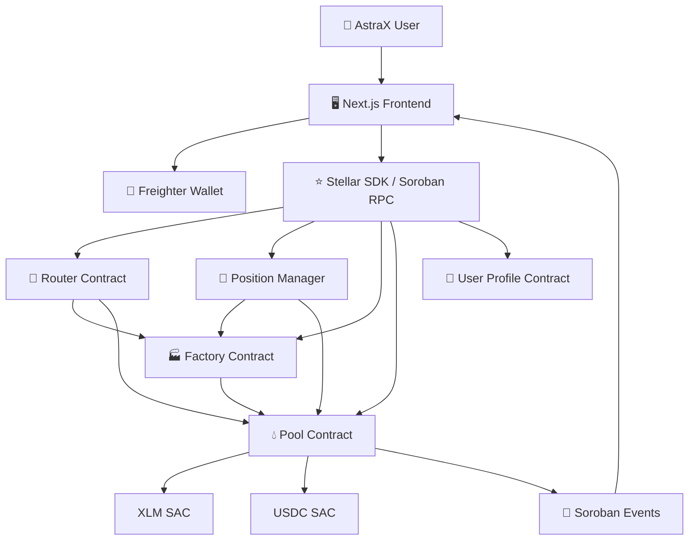
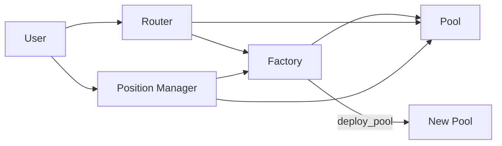
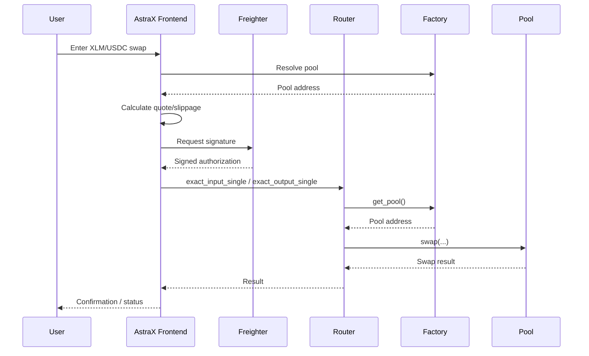
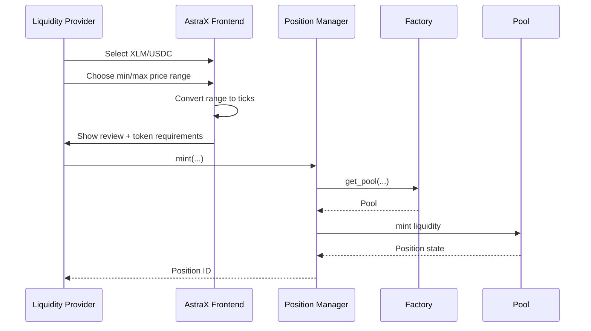
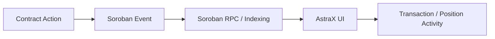
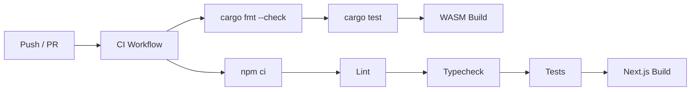

# 🏛 AstraX Architecture

## Overview

AstraX is a **Concentrated Liquidity Market Maker (CLMM) DEX built on Stellar Soroban**. It lets liquidity providers allocate capital inside custom price ranges instead of spreading liquidity across the full price curve.

- **Network:** Stellar Testnet
- **Smart Contract VM:** Soroban
- **Contract Language:** Rust
- **Frontend:** Next.js + React + TypeScript
- **Wallet:** Freighter
- **Primary Pair:** XLM / USDC
- **Live App:** https://orbit-x-two.vercel.app/

---

## 🧩 High-Level Architecture



---

## 🏗 Protocol Components

AstraX is organized as a Cargo workspace containing five main contracts.

```text
contracts/
├── factory/
├── pool/
├── position_manager/
├── router/
├── user_profile/
├── Cargo.toml
├── Cargo.lock
└── Makefile
```

### 1. Factory Contract

The Factory acts as the protocol registry and pool deployment layer.

**Responsibilities**
- Deploy CLMM pools
- Store `(token0, token1, fee) → pool` mappings
- Resolve existing pools
- Store protocol-fee configuration
- Store fee-recipient configuration
- Maintain protocol administration

**Important functions**
```text
initialize
deploy_pool
get_pool
set_pool_price
set_protocol_fee
set_fee_recipient
get_admin
```

**Current Testnet address**
```text
CCDUWTVMG6J4V6SZJBWKO5E24IEYHZEHXJZNIVKQURFN6DATWISOL72T
```

### 2. Pool Contract

The Pool is the core CLMM engine.

It contains:
- Tick-based liquidity accounting
- Swap execution
- Liquidity minting and burning
- Fee accounting
- Tick information
- Position state
- Current pool state (`slot0`)

**Important functions**
```text
swap
mint
burn
collect
slot0
liquidity
get_tick_info
get_position_info
token_0
token_1
fee
tick_spacing
```

**Current XLM/USDC Pool**
```text
CBR7MAQPM35KPK3ULM4FBLEQMQFJZC6N7YWXMPWPYWVPOL2OVNKKBPQV
```

### 3. Router Contract

The Router is the user-facing swap entry point.

**Responsibilities**
- Resolve a pool through the Factory
- Execute single-hop swaps
- Apply price/slippage bounds
- Support exact-input and exact-output flows

**Important functions**
```text
initialize
exact_input_single
exact_output_single
get_pool
factory
```

**Current Testnet address**
```text
CBJR47MFKAATLVITCHAYDXEML4FB4HVTZXK4DPZQPWYNN3AG4GJU3ERD
```

### 4. Position Manager

The Position Manager provides a stable lifecycle around CLMM liquidity positions.

**Responsibilities**
- Create positions
- Assign position IDs
- Decrease liquidity
- Collect fees
- Burn positions
- Enumerate positions by owner

**Important functions**
```text
initialize
mint
decrease_liquidity
collect
burn
get_position
positions_of
next_id
```

**Current Testnet address**
```text
CDARU3KCM2CKQLQ74V4NYJ6V5X6Q4IXLKJGSDEIOLEQAUOAYUQ27QKBH
```

### 5. User Profile Contract

The User Profile contract provides lightweight on-chain profile support through `save_profile` and `get_profile`.

---

## 🔗 Inter-Contract Communication



- **Factory → Pool:** deploys and registers pools.
- **Router → Factory → Pool:** resolves the correct pool then executes a swap.
- **Position Manager → Factory/Pool:** resolves pools and proxies mint/decrease/collect/burn operations.

---

## 💱 Swap Flow



---

## 💧 Liquidity Position Flow



---

## 📡 Event Architecture

State-changing contract actions emit structured events such as `pool_created`, `swap`, `mint`, `burn`, and `collect`.



---

## 🪙 Stellar Assets

| Asset | Soroban Address | Type |
| --- | --- | --- |
| XLM | `CDLZFC3SYJYDZT7K67VZ75HPJVIEUVNIXF47ZG2FB2RMQQVU2HHGCYSC` | Native Stellar Asset Contract |
| USDC | `CBIELTK6YBZJU5UP2WWQEUCYKLPU6AUNZ2BQ4WWFEIE3USCIHMXQDAMA` | SEP-41 Stellar Asset Contract |

USDC Classic issuer:
```text
GBBD47IF6LWK7P7MDEVSCWR7DPUWV3NY3DTQEVFL4NAT4AQH3ZLLFLA5
```

---

## 🚀 Current Stellar Testnet Deployments

| Contract | Address |
| --- | --- |
| Factory | `CDFY5UX77PQDP2QGNY4YGZVKK6FE6J2LSSVZFXTQSHRO2JIES7LSZGPE` |
| XLM/USDC Pool (0.3%) | `CCYBX2FOT5RWL6T2CQROAA3ZECYNNE3PSJ7WQXULU6AJOCCK6YHSTH32` |
| Router | `CDLCGPUP7NW4B4SSFG5H4I75PKDGPUZDHOX5C6YICJY7RDJ7VP7BAT62` |
| Position Manager | `CC6IBQ7VNVK7CQYIZX47NJPDH5DL5ISQSA26BLBZXVMVEQ3QGUAZDREI` |

> These are the current canonical addresses from the root README. Older deployment addresses should be removed or clearly marked as historical.

---

## 🖥 Frontend Architecture

```text
frontend/
├── app/
├── components/
├── config/
├── context/
├── education/
├── hooks/
├── lib/
├── public/
├── next.config.ts
├── package.json
└── tsconfig.json
```

Main product pages:
- `/swap`
- `/liquidity`
- `/portfolio`

Frontend responsibilities include wallet connection, swap quoting, slippage controls, liquidity-range selection, position management, portfolio views, transaction review, and educational guidance.

---

## ⚙️ CI/CD Architecture

AstraX includes GitHub Actions for contract and frontend validation.



The deployment workflow builds contracts and deploys the frontend to Vercel when configured secrets are available.

---

## 🔐 Design Principles

1. **Modularity** — Factory, Pool, Router and Position Manager have separate responsibilities.
2. **Non-custodial authorization** — users approve blockchain actions through their wallet.
3. **Range-based liquidity** — LP capital is concentrated inside user-selected ticks.
4. **Verifiable execution** — contract activity is inspectable on Stellar Testnet.
5. **Frontend safety checks** — reviews, balance validation and slippage controls reduce user error.
6. **Composability** — contracts call each other rather than duplicating core CLMM logic.

---

## 🔭 Future Architecture

Future work may include:
- More Stellar asset pools
- Multi-hop routing
- TWAP/oracle infrastructure
- Advanced LP analytics
- Automated liquidity strategies
- Protocol fees/governance
- Additional Stellar wallets
- Security review and Mainnet readiness
